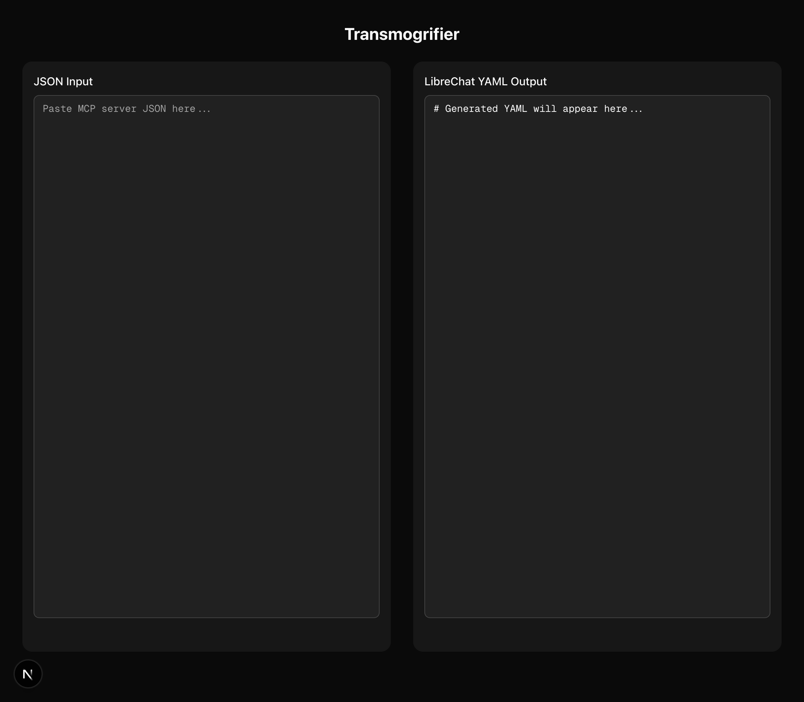
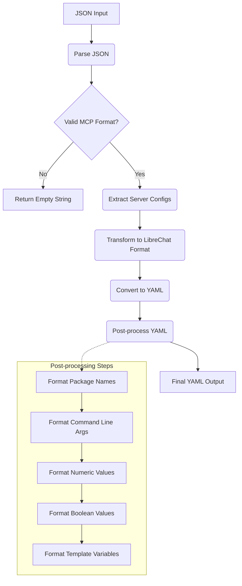

# Transmogrifier

[](https://opensource.org/licenses/MIT)
[](https://nextjs.org/)
[](https://react.dev/)
[](https://www.typescriptlang.org/)
[](https://tailwindcss.com/)
[](https://ui.shadcn.com/)

A web application that converts MCP server JSON configurations to LibreChat YAML format. This tool allows you to paste MCP configurations from VSCode, Claude Desktop, Windsurf, and other sources and instantly get the properly formatted YAML needed for LibreChat.



> **Note:** This entire project, including all code, documentation, and configuration, was generated using AI. The implementation follows best practices for TypeScript, React, and Next.js development.

## ✨ Quick Start

1.  **Clone the repository:**
    ```bash
    git clone https://github.com/apoloqize/transmogrifier.git
    cd transmogrifier
    ```
2.  **Install dependencies:**
    ```bash
    npm install
    ```
3.  **Run the development server:**
    ```bash
    make dev
    # or
    # npm run dev
    ```
4.  Open [http://localhost:3000](http://localhost:3000) with your browser to see the result.

## 🚀 Features

-   🔄 **Instant Conversion:** Converts JSON configurations to LibreChat YAML format in real-time.
-   🧩 **Multi-Format Support:** Handles various MCP server JSON structures (VSCode, Claude Desktop, Windsurf, etc.).
-   📋 **One-Click Copy:** Easily copy the generated YAML to your clipboard.
-   🚨 **Real-time Validation:** Validates JSON input as you type and provides instant feedback.
-   💻 **Clean & Responsive UI:** Modern and intuitive user interface built with Shadcn UI and Tailwind CSS.
-   🛠️ **Comprehensive Conversion:** Supports all server types (`stdio`, `websocket`, `sse`), automatic type inference, headers with template variables, and all optional properties as per [LibreChat MCP Servers Object Structure documentation](https://www.librechat.ai/docs/configuration/librechat_yaml/object_structure/mcp_servers).

## 🛠️ Converter Utility

The core of this application is the `converter.ts` utility, which transforms JSON MCP server configurations into LibreChat YAML format.



## 📦 Deployment & Development Environments

This project supports multiple ways to run and develop:

### Using Docker

A `Dockerfile` is provided to build and run the application in a containerized environment.

1.  **Build the Docker image:**
    ```bash
    docker build -t transmogrifier .
    ```
2.  **Run the Docker container:**
    ```bash
    docker run -p 3000:3000 transmogrifier
    ```
    The application will be accessible at `http://localhost:3000`.

### Using Dev Containers (VS Code)

For a consistent development environment in VS Code, a Dev Container configuration is provided.

1.  **Prerequisites:**
    *   Docker Desktop installed and running.
    *   VS Code installed.
    *   [Dev Containers extension](https://marketplace.visualstudio.com/items?itemName=ms-vscode-remote.remote-containers) installed in VS Code.
2.  **Open in Container:**
    *   Clone this repository and open it in VS Code.
    *   VS Code should prompt you to "Reopen in Container". Click it.
    *   Alternatively, use the Command Palette (Ctrl+Shift+P or Cmd+Shift+P) and select "Dev Containers: Reopen in Container".
    *   The first launch will build the dev container image. Subsequent launches will be faster.
3.  Once the container is running, you can use the integrated terminal to run development commands (e.g., `npm run dev`).

### Using Nix with Devenv

For a reproducible and declarative development environment using Nix:

1.  **Prerequisites:**
    *   [Nix package manager](https://nixos.org/download.html) installed.
    *   [direnv](https://direnv.net/) installed (e.g., `nix-env -iA nixpkgs.direnv`).
    *   `nix-direnv` configured in your shell (add `source $HOME/.nix-profile/share/nix-direnv/direnvrc` or similar to your shell's rc file).
    *   (Recommended) [Cachix](https://cachix.org/) client installed (`nix-env -iA nixpkgs.cachix`) and devenv cache enabled (`cachix use devenv`).
2.  **Activate Environment:**
    *   Clone this repository.
    *   Navigate to the project directory in your terminal.
    *   Run `direnv allow`.
    *   The first time, `devenv` will build the Nix environment. This might take a while.
3.  The shell will now have Node.js, npm, and other specified tools available. You can run scripts like `npm run dev` or `devenv run dev`.

## ⚙️ Manual Getting Started

### Prerequisites

-   Node.js 18.17.0 or later
-   npm (comes with Node.js) or yarn

### Installation & Setup

1.  **Clone the repository:**
    ```bash
    git clone https://github.com/apoloqize/transmogrifier.git
    cd transmogrifier
    ```
2.  **Install dependencies:**
    ```bash
    npm install
    ```
3.  **Run the development server:**
    ```bash
    make dev
    ```
    Alternatively, you can use:
    ```bash
    npm run dev
    ```
4.  Open [http://localhost:3000](http://localhost:3000) with your browser to see the application.

## 🧪 Testing

### Running Unit Tests

Execute the test suite using:
```bash
make test
```
Or:
```bash
npm run test
```

### Manual Testing

1.  Start the development server: `make dev` or `npm run dev`.
2.  Open the application in your browser.
3.  Paste different valid and invalid JSON configurations into the input area to verify functionality and error handling.

##  Usage

1.  Navigate to the Transmogrifier application in your browser.
2.  Paste your MCP server JSON configuration into the **JSON Input** text area on the left.
3.  The converted LibreChat YAML will automatically appear in the **LibreChat YAML Output** text area on the right.
4.  Click anywhere on the YAML output text area to copy the content to your clipboard. A success notification will appear.

### Supported JSON Formats

The tool supports the following common JSON structures for MCP server configurations:

**Format 1: `mcpServers` object (e.g., Context7, Windsurf)**
```javascript
{
  "mcpServers": {
    "stdio-server": {
      "command": "npx",
      "args": ["-y", "@modelcontextprotocol/server-puppeteer"],
      "env": { "NODE_ENV": "production" },
      // ... other properties
    },
    "sse-server": {
      "type": "sse",
      "url": "https://mcp.example.dev/sse-endpoint",
      "headers": { "X-API-Key": "${SOME_API_KEY}" },
      // ... other properties
    }
  }
}
```

**Format 2: `servers` object (e.g., VSCode settings)**
```javascript
{
  "servers": {
    "my-server": {
      "type": "stdio",
      "command": "my-command",
      "args": ["--flag"]
      // ... other properties
    }
  }
}
```

**Format 3: `mcp.servers` nested object (e.g., Claude Desktop)**
```javascript
{
  "mcp": {
    "servers": {
      "another-server": {
        "command": "run-this",
        "args": ["param1", "param2"]
        // ... other properties
      }
    }
  }
}
```
For a full list of supported properties, refer to the [LibreChat MCP Servers Object Structure documentation](https://www.librechat.ai/docs/configuration/librechat_yaml/object_structure/mcp_servers).

### Output Format Example

The tool generates YAML in the format required by LibreChat:
```yaml
mcpServers:
  stdio-server:
    type: stdio
    command: npx
    args:
      - '-y'
      - '@modelcontextprotocol/server-puppeteer'
    env:
      NODE_ENV: production
    # ... other properties

  sse-server:
    type: sse
    url: https://mcp.example.dev/sse-endpoint
    headers:
      X-API-Key: ${SOME_API_KEY}
    # ... other properties
```

## 💻 Technology Stack

-   [Next.js 15](https://nextjs.org/) - React framework for production
-   [React 19](https://react.dev/) - JavaScript library for building user interfaces
-   [TypeScript](https://www.typescriptlang.org/) - Typed superset of JavaScript
-   [Tailwind CSS](https://tailwindcss.com/) - Utility-first CSS framework
-   [Shadcn UI](https://ui.shadcn.com/) - Re-usable components built with Radix UI and Tailwind CSS
-   [js-yaml](https://github.com/nodeca/js-yaml) - YAML 1.2 parser and writer for JavaScript
-   [Jest](https://jestjs.io/) & [React Testing Library](https://testing-library.com/docs/react-testing-library/intro/) - For unit and component testing

## 🔄 CI/CD

This project uses GitHub Actions for Continuous Integration. The workflow (defined in `.github/workflows/ci.yml`) automatically runs tests, lints the code, and builds the project on pushes and pull requests to the `main` branch.

## 🤝 Contributing

Contributions are welcome! We appreciate any help to improve Transmogrifier. Please see our [Contributing Guide](CONTRIBUTING.md) for detailed instructions on how to report bugs, suggest enhancements, and submit pull requests.

Ensure you follow our [Code of Conduct](CODE_OF_CONDUCT.md).

## 📜 License

This project is licensed under the MIT License - see the [LICENSE](LICENSE) file for details.
